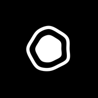

# BrightCollect

**Photograph a thing. Keep the thing, not the photograph.**

A collector for the Light Phone III. Point it at an object, press the shutter, and the object
is cut out of its background and kept as a sticker with a transparent edge. The shelf is the
collection. Send one to somebody in BrightChat; the day you caught it shows up on
BrightNotebook's calendar.

<p align="center">
  
</p>

## What it does

- **Cuts things out on the phone.** A 4.4 MB neural network is bundled in the APK. Nothing is
  uploaded, and it works with the radio off.
- **Guesses what the thing is.** A second bundled model labels the finished cutout and prefills
  the name, already selected, so a wrong guess costs one keystroke.
- **Lays the collection out like a flat lay**, not a grid: each sticker at its own size and
  angle, packed against its neighbours.
- **Lets you fix it when it is wrong.** A magic wand takes a whole region of similar colour in
  one tap; a brush handles the edges the wand cannot describe. Both work in KEEP or CUT.
- **Shows the collection in colour.** The LPIII panel is a full-colour AMOLED that LightOS
  pins to greyscale. The shelf lifts the pin, because a hundred grey cutouts are a hundred
  grey blobs. One adb line, below.
- **Sends a sticker to BrightChat** as a PNG with its alpha intact.
- **Puts captures on BrightNotebook's day** as stickers rather than photographs. It serves a
  provider the notebook reads by date; nothing is copied and neither side needs a permission.
- **Takes a photograph from Roll.** Collect registers as somewhere to send an image, so
  anything already on the roll can become a sticker.

## Install

Scan the code at **[brightmarket.gzl.dev](https://brightmarket.gzl.dev)** and let BrightMarket
keep it updated, or take the APK from
[Releases](https://github.com/gi-os/BrightCollect/releases/latest).

The colour shelf needs one grant that no installer can give, because the permission is
`signature|privileged|development`:

```
adb shell pm grant com.gios.brightcollect android.permission.WRITE_SECURE_SETTINGS
```

Without it the app works and stays grey.

## How the cutout works

`u2netp` — the small variant of U-2-Net, trained for class-agnostic salient object detection —
runs through ONNX Runtime on four threads. The photograph is squashed to 320×320, normalised
with ImageNet statistics, and comes back as a sigmoid map that is stretched to its observed
range, hardened, scaled up, and feathered. About 300 ms on the LPIII.

**Not ML Kit.** Its Subject Segmentation API is the *unbundled* kind, delivered through Play
Services, and LightOS runs microG — the call binds and never answers. That is the same trap
that made Roll use ZXing for barcodes. ML Kit's only bundled segmenter finds people, and this
app is for objects.

The APK is about 47 MB, and almost all of it is two inference runtimes: ONNX Runtime's arm64
library is 26 MB and ML Kit's is another 10.5 MB. The models themselves are small — 4.4 MB for
the cutout, 2.9 MB for the labeller. There is one ABI in there on purpose: four would put it
past 150 MB, and the LPIII is arm64.

## Building

```
./gradlew :app:assembleDebug
```

`com.gios:light-common` comes from GitHub Packages, which has no anonymous read even for
public packages. Put a PAT with `read:packages` in `local.properties`:

```
gpr.user=your-username
gpr.key=ghp_...
```

Unit tests cover the parts that decide which pixels end up in a sticker — the mask arithmetic,
the flood fill, and the index — all of which are free of Android imports on purpose:

```
./gradlew :app:testDebugUnitTest
```

## Credits

The model is [U-2-Net](https://github.com/xuebinqin/U-2-Net) by Xuebin Qin et al., Apache-2.0.
The design language, the icon set and the type scale are ported from
[lightphone/light-sdk](https://github.com/lightphone/light-sdk) (MIT) — see
`LICENSE-light-sdk`.
<!-- bright-footer:begin -->
---

## Bright\*

**It's not Light, it's Bright.**

27 open-source apps for the **Light Phone III** — camera, music, maps, messages,
reading, transit, games. The phone has no app store, so they install by sideload: scan one
code from **[brightmarket.gzl.dev](https://brightmarket.gzl.dev)** and BrightMarket keeps them updated.

[Roll](https://github.com/gi-os/Roll) · **BrightCollect** (you are here) · [BrightNotebook](https://github.com/gi-os/BrightNotebook) · [BrightControl](https://github.com/gi-os/BrightControl) · [BrightWay](https://github.com/gi-os/BrightWay) · [BrightChat](https://github.com/gi-os/BrightChat) · [browse all 27 →](https://brightmarket.gzl.dev)

The Light Phone does not sponsor or endorse any of these. Built by
[Giovanni Lupo](https://github.com/gi-os) — if this one is useful to you, a ⭐ helps the next
person find it.
<!-- bright-footer:end -->
